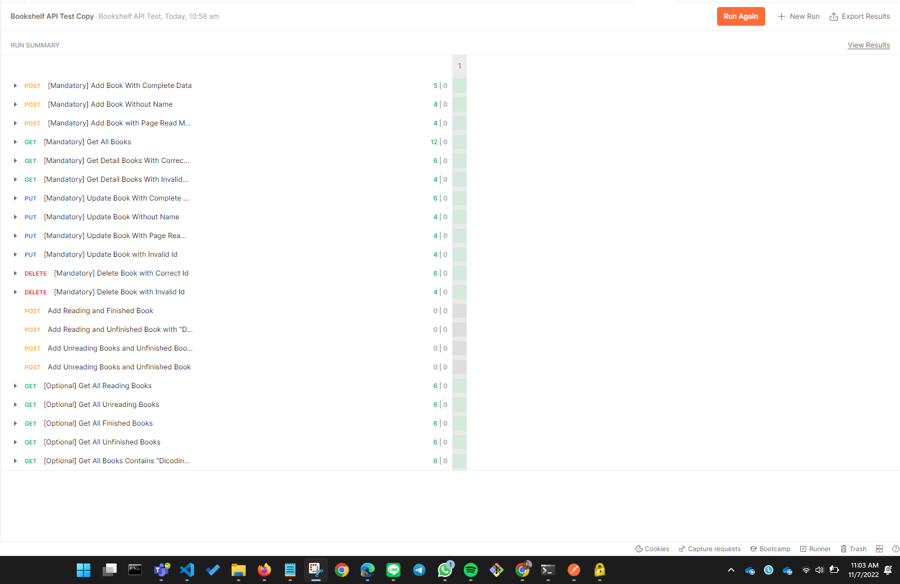
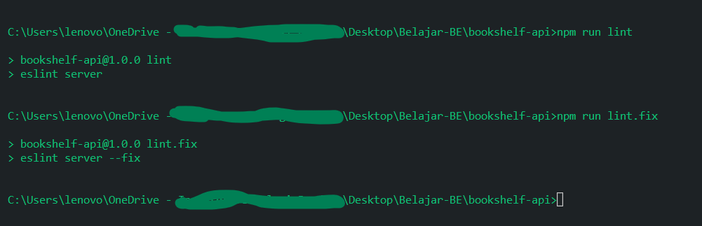

# bookshelf-api
ini adalah submition untuk dicoding

## run apps:
1. npm install
2. npm start

## run eslint : 
npm run lint

## List API:

>[1] API dapat menyimpan buku

>[2] API dapat menampilkan seluruh buku

>[3] API dapat menampilkan detail buku

>[4] API dapat mengubah data buku

>[5] API dapat menghapus buku

## Hasil testing
### Postman

### Eslint run

